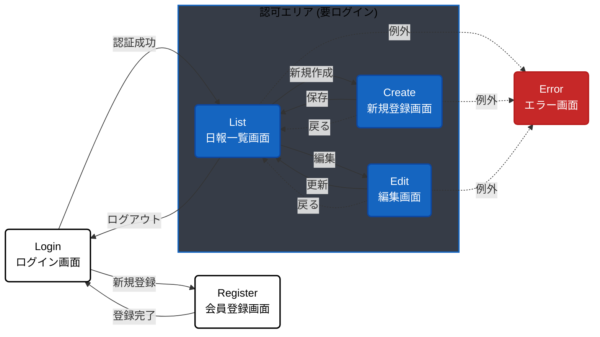
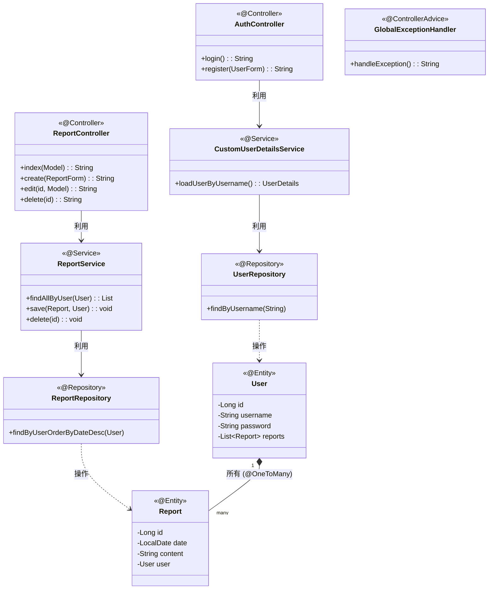
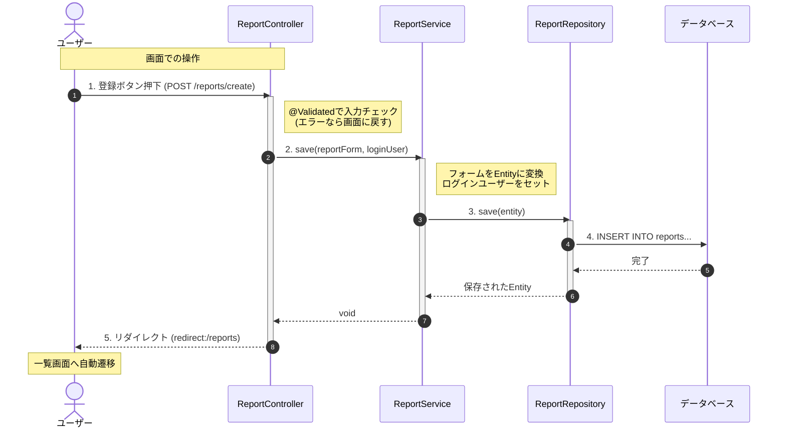

# 日報管理システム (Spring Boot版)

Spring Boot を使用して構築された、Webベースの日報管理アプリケーションです。
従来のServlet/JSP（レガシー構成）との比較学習用に、モダンなアーキテクチャを採用して実装されています。
レガシー版はこちら(※今後公開予定)

Demo URL:https://learning-tracker-tototo878742.onrender.com/

## 概要
ユーザーが日々の業務内容を記録・管理するためのシステムです。
Spring Securityによる認証機能、Spring Data JPAによる効率的なDB操作を備えています。

## 機能一覧

* **ユーザー認証**
  * ログイン / ログアウト
  * 新規会員登録
  * アクセス制御（未ログインユーザーの制限）
* **日報管理 (CRUD)**
  * 新規登録
  * 一覧表示（ログインユーザー自身のデータのみ）
  * 編集
  * 削除

## 技術スタック

* **言語:** Java 17
* **フレームワーク:** Spring Boot 4.0.2
* **テンプレートエンジン:** Thymeleaf
* **データベース:** postgreSQL Neon(本番想定) / H2 (開発用)
* **O/Rマッパー:** Spring Data JPA
* **CSS:** Bootstrap 5

## アーキテクチャ構成

Spring Boot推奨のレイヤードアーキテクチャを採用しています。

1. **Controller (@Controller):** 画面遷移と入力を制御
2. **Service (@Service):** 業務ロジック、トランザクション管理
3. **Repository (@Repository):** データベース操作 (Spring Data JPA)
4. **Entity (@Entity):** データベースのテーブル定義

## 📐 設計図 (Architecture)

### 画面遷移図 

### クラス図 (Class Diagram)

### シーケンス図 (Sequence Diagram)

